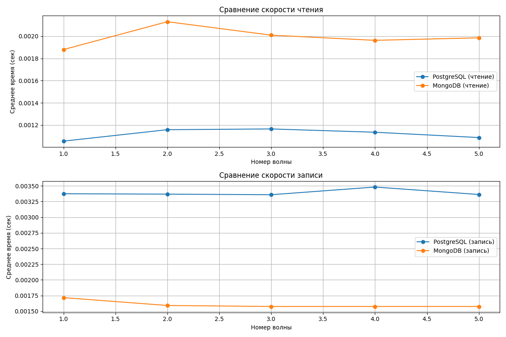

# Сравнение производительности баз данных

В этом отчете сравнивается производительность PostgreSQL и MongoDB для конкретных операций чтения и записи.

## Результаты тестов

### График производительности



## Сценарии тестирования

1. **Сравнение скорости записи** : Простая запись с последующим чтением (можем приравнять к "обновлению").
2. **Сравнение скорости чтения** : Агрегационные запросы.

## Вывод

Mongo быстрее в простых операциях в рамках документа, Postgres нацелен на сложные запросы.

## Как воспроизвести

1. Запустите базы данных с помощью Docker Compose:
   ```bash
   docker-compose up -d
   ```
2. Запустите скрипт генерации данных:
   ```bash
   python generate_data.py
   ```
3. Запустите скрипт загрузки данных:
   ```bash
   python load_data.py
   ```
4. Выполните тесты производительности:
   ```bash
   python test_performance.py
   ```
